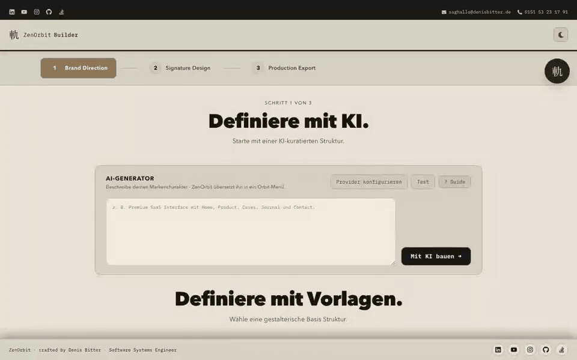

# ZenOrbit

**Identity in Motion — visuell gestaltete Orbit-Navigation für React.**


[](https://zenorbit.denisbitter.de)
[](https://www.npmjs.com/package/@denisbitter/bitter-button-menu)
[](https://react.dev/)

ZenOrbit ist ein visueller Builder und Customizer für radiale Menüs. Du wählst eine Stilrichtung, passt Form, Farben, Bewegung und Inhalte in der Live-Vorschau an und exportierst das Ergebnis für dein Projekt.

[Builder öffnen](https://zenorbit.denisbitter.de/builder) · [Customizer öffnen](https://zenorbit.denisbitter.de/customizer) · [Guide lesen](https://zenorbit.denisbitter.de/guide)



## So funktioniert ZenOrbit


1. **Stil wählen** – mit einem Template als visuelle Basis beginnen.
2. **Orbit gestalten** – Logo, Farben, Radius, Menüelemente und Bewegung direkt bearbeiten.
3. **Live prüfen** – Navigation und Interaktionen sofort in der Vorschau testen.
4. **Feintuning** – die Konfiguration im Customizer präzisieren und als JSON sichern.
5. **Exportieren** – das Menü als React-, CSS- oder eigenständiges HTML-Paket übernehmen.

## Funktionen

| Bereich | Was er bietet |
| --- | --- |
| Builder | Geführter Ablauf von Brand Direction über Design bis zum Production Export |
| Customizer | Präzise Kontrolle über Radius, Positionen, Farben, Motion und Submenüs |
| Live-Vorschau | Änderungen unmittelbar am interaktiven Orbit-Menü beurteilen |
| AI-Generator | Aus einer Beschreibung einen ersten Menüentwurf erzeugen; eigener Provider/API-Key |
| JSON-Workflow | Entwürfe speichern, wieder laden und zwischen Werkzeugen austauschen |
| Delivery Studio | React mit Tailwind, React mit CSS, Pure CSS oder HTML-Standalone exportieren |
| Desktop-App | ZenOrbit lokal als Tauri-Anwendung ausführen und bauen |

## Als npm-Komponente verwenden

Wenn du keinen Builder benötigst, kannst du das Orbit-Menü direkt in ein bestehendes React-Projekt einbauen:

```bash
npm install @denisbitter/bitter-button-menu framer-motion
```

```jsx
import BitterButtonWithMenu from '@denisbitter/bitter-button-menu';

const menuItems = [
  { id: 'home', label: 'Home', angle: 0, route: '/' },
  { id: 'about', label: 'Über uns', angle: -90, route: '/about' },
  { id: 'contact', label: 'Kontakt', angle: -180, route: '/contact' },
];

export default function App() {
  return (
    <BitterButtonWithMenu
      logoSrc="/logo.svg"
      logoAlt="Navigation öffnen"
      mainMenuItems={menuItems}
      accentColor="#AC8E66"
    />
  );
}
```

- [Paket auf npm](https://www.npmjs.com/package/@denisbitter/bitter-button-menu)
- [Quellcode der Komponente](https://github.com/THEORIGINALBITTER/bitter-button-menu)

Das npm-Paket enthält die wiederverwendbare React-Komponente. Dieses Repository enthält die vollständige ZenOrbit-Web- und Desktop-Anwendung mit Builder und Customizer.

## Lokale Entwicklung

Voraussetzungen: eine aktuelle Node.js- und npm-Version.

```bash
git clone https://github.com/THEORIGINALBITTER/zenorbit.git
cd zenorbit
npm install
npm run dev
```

Anschließend läuft ZenOrbit standardmäßig unter [http://localhost:5173](http://localhost:5173).

### Wichtige Befehle

```bash
npm run dev       # Entwicklungsserver
npm run build     # Produktions-Build nach dist/
npm run preview   # Produktions-Build lokal prüfen
npm test          # Tests ausführen
npm run lint      # Code prüfen
```

## AI-Features aktivieren

Die AI-Funktionen sind optional und verwenden den vom Nutzer konfigurierten Provider.

```bash
cp .env.example .env.local
```

Danach den benötigten API-Key in `.env.local` eintragen. Geheimnisse niemals committen.

## Desktop-App mit Tauri

Zusätzliche Voraussetzungen sind Rust und Cargo; unter macOS außerdem die Xcode Command Line Tools.

```bash
npm run tauri:dev
npm run tauri:build
```

Die Tauri-Konfiguration befindet sich in `src-tauri/tauri.conf.json`.

## Routen

| Route | Inhalt |
| --- | --- |
| `/` | Landingpage mit interaktiver Demo |
| `/builder` | Geführter Drei-Schritt-Builder |
| `/customizer` | Detaillierter Profi-Customizer |
| `/guide` | Dokumentation und Schritt-für-Schritt-Anleitung |
| `/pro` | Angebote, Lizenzen und Leistungen |

## Dokumentation

- [Gesamtdokumentation](DOCS.md)
- [Deployment-Anleitung](DEPLOYMENT.md)
- [Online-Guide](https://zenorbit.denisbitter.de/guide)
- [ZenOrbit Figma Plugin](https://github.com/THEORIGINALBITTER/ZenOrbit-Figma-Plugin)

## Deployment

Bei einem Push auf `main` baut die vorhandene GitHub Action die Web-App und veröffentlicht sie per FTP auf dem konfigurierten IONOS-Webspace. Die benötigten Repository-Secrets sind in der [Deployment-Anleitung](DEPLOYMENT.md) beschrieben.

Für einen manuellen Build:

```bash
npm run build
```

Das Ergebnis liegt anschließend in `dist/`. Die `.htaccess` aus `public/` sorgt beim Deployment dafür, dass die React-Routen korrekt auf `index.html` zurückfallen.

## Technischer Stack

- Vite und React 19
- React Router
- Framer Motion
- Tauri für die Desktop-App
- `orbify-core` für Konfiguration, Validierung und Geometrie
- `orbify-ai` für Intent-Auflösung und AI-gestützte Menüentwürfe

## Projektfamilie

- [`@denisbitter/bitter-button-menu`](https://www.npmjs.com/package/@denisbitter/bitter-button-menu) – wiederverwendbare React-Komponente
- [ZenOrbit Figma Plugin](https://github.com/THEORIGINALBITTER/ZenOrbit-Figma-Plugin) – Austausch von ZenOrbit-Projektdateien mit Figma
- [ZenOrbit](https://zenorbit.denisbitter.de) – Web-Builder und Customizer

---

Crafted by [Denis Bitter](https://denisbitter.de) · Software Systems Engineer
